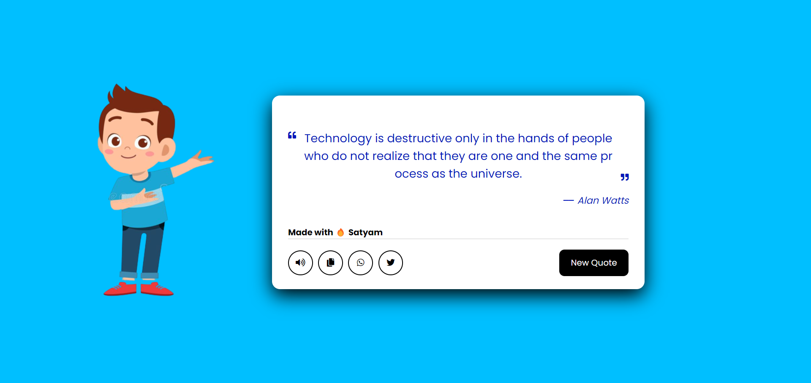

<h1 align="">
   Dynamic_Quotes_website
   <h4> ✌️A program that displays a randomly selected quote each time the user clicks a button. ... Create Dynamic Quotes using Node.js and Express.js
       
    live demo 👉 https://dynamic-qoutes.netlify.app/
    

     
  </h4>
    
    
   
</h1>

